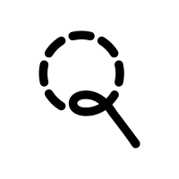

<div align="center">
  
  
  # CircleSearch
  
  **Circle anything on your Mac screen to reverse image search it.**
  
  A lightweight menu bar utility inspired by Google Pixel's Circle to Search.
  Press a hotkey, draw around what you want to identify, and your browser opens
  with the result.
</div>

---

## Demo

<!-- TODO: add demo gif/video here -->

## Features

- **Global hotkey** activates the selection overlay from any app
- **Two selection modes** — freeform lasso or rectangle
- **Live cutout overlay** — your selection is clear while everything else dims, so you can see exactly what you're capturing
- **Multiple search engines** — Google Lens, Yandex, and Bing Visual Search built in, plus support for adding your own
- **Customizable shortcut** — record any modifier + key combo
- **Launch at login** — set it and forget it
- **Retina-accurate capture** using `ScreenCaptureKit`
- **Menu bar only** — no Dock icon, stays out of your way

## Installation

1. Download the latest `CircleSearch.app` from [Releases](https://github.com/liammmauliffe/CircleSearch/releases)
2. Drag it into your **Applications** folder
3. Open it from Applications (right-click → Open the first time, since it's not notarized)
4. Grant the two required permissions when prompted:
   - **Accessibility** — needed to detect the global hotkey
   - **Screen Recording** — needed to capture the selected region
5. The magnifying glass icon appears in your menu bar

## Usage

Default shortcut: **⌘ + ⌃ + S**

1. Press the shortcut from any app
2. The screen dims with a translucent overlay
3. Draw around what you want to identify (a lasso or rectangle, depending on your mode)
4. Release the mouse — a brief preview shows the captured area
5. Your default browser opens with the search results
6. Press **Escape** at any time to cancel

Open **Preferences** from the menu bar icon to change the shortcut, switch selection mode, or pick a different search engine.

## Search engines

CircleSearch ships with three built-in engines:

| Engine             | Strengths                                         |
| ------------------ | ------------------------------------------------- |
| Google Lens        | Best general-purpose results, OCR, shopping       |
| Yandex             | Best for finding source images, people, landmarks |
| Bing Visual Search | Solid alternative, good for products              |

### Adding your own

Open **Preferences → Search engine → +** and enter:

- **Name** — display name for the engine
- **URL template** — the search URL with `{url}` where the image URL should appear

Example for [TinEye](https://tineye.com):

```
https://www.tineye.com/search?url={url}
```

## Tech notes

- Built with **Swift** and **AppKit**
- Screen capture via **ScreenCaptureKit** (macOS 12.3+)
- Launch-at-login via **ServiceManagement** (macOS 13+)
- Images uploaded to [Uguu](https://uguu.se) for the search engines to fetch
- No analytics, no accounts, no telemetry

**Requirements:** macOS 13 Ventura or later.

## Roadmap

### v1 (current)

- [x] Global hotkey + selection overlay
- [x] Lasso and rectangle selection modes
- [x] Cutout overlay with corner brackets
- [x] Three built-in search engines + custom engines
- [x] Customizable shortcut
- [x] Launch at login

### v2 — polish & features

- [ ] Loading indicator during upload
- [ ] Crosshair cursor 
- [ ] Multi-monitor support (overlay on cursor's screen)

### v3 — self-hosted

- [ ] Replace third-party image host with a self-hosted backend
- [ ] Option to keep images local (clipboard-only mode will see how it would work)
- [ ] Auto-update support

## Contributing

Issues and pull requests welcome. This started as a personal learning project, so the code is approachable — a great place to dig into AppKit, event taps, and ScreenCaptureKit.

If you're filing a bug, please include:

- Your macOS version
- Whether the issue is reproducible
- Console output if relevant (run from Xcode and copy any errors)

For feature ideas, open an issue first so we can discuss the approach before you spend time on a PR.

## License

[MIT](LICENSE)
